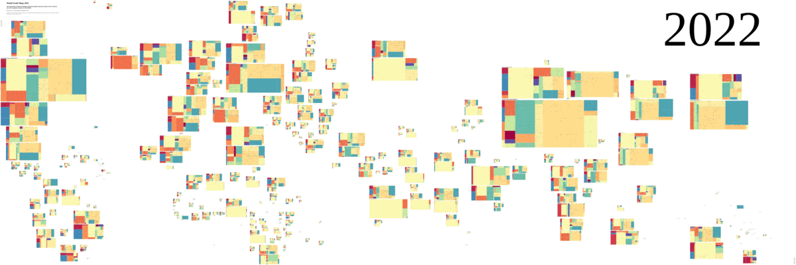

# World Trade Map 

Area-preserving pseudo projected cartogram treemaps of world countries annual net import/export in US$ by HS4 categories from 1995 to 2023:

[1995](https://xdqc.github.io/world-trade-map/worldtrademap-1995.html)
[1996](https://xdqc.github.io/world-trade-map/worldtrademap-1996.html)
[1997](https://xdqc.github.io/world-trade-map/worldtrademap-1997.html)
[1998](https://xdqc.github.io/world-trade-map/worldtrademap-1998.html)
[1999](https://xdqc.github.io/world-trade-map/worldtrademap-1999.html)
[2000](https://xdqc.github.io/world-trade-map/worldtrademap-2000.html)
[2001](https://xdqc.github.io/world-trade-map/worldtrademap-2001.html)
[2002](https://xdqc.github.io/world-trade-map/worldtrademap-2002.html)
[2003](https://xdqc.github.io/world-trade-map/worldtrademap-2003.html)
[2004](https://xdqc.github.io/world-trade-map/worldtrademap-2004.html)
[2005](https://xdqc.github.io/world-trade-map/worldtrademap-2005.html)
[2006](https://xdqc.github.io/world-trade-map/worldtrademap-2006.html)
[2007](https://xdqc.github.io/world-trade-map/worldtrademap-2007.html)
[2008](https://xdqc.github.io/world-trade-map/worldtrademap-2008.html)
[2009](https://xdqc.github.io/world-trade-map/worldtrademap-2009.html)
[2010](https://xdqc.github.io/world-trade-map/worldtrademap-2010.html)
[2011](https://xdqc.github.io/world-trade-map/worldtrademap-2011.html)
[2012](https://xdqc.github.io/world-trade-map/worldtrademap-2012.html)
[2013](https://xdqc.github.io/world-trade-map/worldtrademap-2013.html)
[2014](https://xdqc.github.io/world-trade-map/worldtrademap-2014.html)
[2015](https://xdqc.github.io/world-trade-map/worldtrademap-2015.html)
[2016](https://xdqc.github.io/world-trade-map/worldtrademap-2016.html)
[2017](https://xdqc.github.io/world-trade-map/worldtrademap-2017.html)
[2018](https://xdqc.github.io/world-trade-map/worldtrademap-2018.html)
[2019](https://xdqc.github.io/world-trade-map/worldtrademap-2019.html)
[2020](https://xdqc.github.io/world-trade-map/worldtrademap-2020.html)
[2021](https://xdqc.github.io/world-trade-map/worldtrademap-2021.html)
[2022](https://xdqc.github.io/world-trade-map/worldtrademap-2022.html)
[2023](https://xdqc.github.io/world-trade-map/worldtrademap-2023.html)

The maps present intuitive answers to questions such as:

- Who are the flag states?
- Where most trees are deforested to ship out?
- When the rhythm of gold reserve breathing in & out between London and Zürich?
- Which country exports most agri & food after the US?
- What natural resource in periodic table does Japan export?
- Why Norway is not joining EU?
- How is Hong Kong being the infusion tube of Chinese economy?

and much more...

## FAQ

### Gross vs Net import/export

Gross import/export value is the actual import/export values of trading goods, products or commodities per category.

Net import/export value is the value of deficit/surplus trading goods per category. In this case, each HS4 chapter of trading goods can only be counted as either import or export in the catogram of treemaps. For instance, a country imports 400B and exports 50B crude oil, the net value only counts 350B crude oil as imports. 

The overall summation of all categories *in net* deficit/surplus per country is constantly equal to *in gross* deficit/surplus, no matter how granular the classification of trading goods is calculated. 

### Harmonised System: HS2, HS4 and HS6

The Harmonised System, HS, nomenclature allows you to identify precisely your product and check what tariff lines and rules apply. It is a logical structure to classify goods, used uniformly by customs authorities around the world.

- HS2 (sections) is 2 digits classification code of trading goods, showing as the color of each block
  - HS4 (chapters) adds 2 more digits of details to HS2
    - HS6 (headings) adds 2 more digits of details to HS4

To calculate net import/export, using more detailed granularity of classification, the larger net import and net export values respectively you will get. When comparing net import/export values per category, the more details is not necessarily adding more information. Supposing we classify trading goods to extreme granularity per product serial number, ISBN or EAN, the net value would be almost same as gross value, thus calculating net value is mearly adding insights of net surplus or deficit anymore. 

Here we drill down to HS4 to make the graph. Comparing to HS4, HS6 adds marginal accuracy, while extra verbosity of lengthy terminologies of most goods. For general audience who are not professional in trading business, HS4 descriptions are succinct and more relevant to common sense than HS6, but there are exceptions, i.e., the HS4 chapter *malt extract* majorly indicates infant milk formula; the HS4 chapter *photo lab equipment* largely means semiconductor lithography system.

### Inflation adjusted actual trade growth

To display the actual global trade growth or recessions year over years, the trading values in US dollar are inflation adjusted.

Cumulative inflation is adjusted as worth in 2020, using the tool provided by the U.S. Federal Reserve Bank of Minneapolis https://www.minneapolisfed.org/about-us/monetary-policy/inflation-calculator

### Groups of countries

Groups of countries or regions are often referred to by a single term (word, phrase, or abbreviation). The origins of such terms include political alliances, intergovernmental organizations, business market areas, and mere colloquialism.

Trade maps of contemporary [Country groupings](https://en.wikipedia.org/wiki/List_of_country_groupings) can be generated with the script. It is also possible to generate arbitrary groups for instance: 

- [Island-Landlocked-Coastal](https://xdqc.github.io/world-trade-map/Islands_Landlocked_Coastal.html)

- Former [Axis-Anglo-Commie-TheRest](https://xdqc.github.io/world-trade-map/Axis_Commie_Anglo_Rest.html)

### Data source

https://oec.world/

### Visualization tool

https://rawgraphs.io/

### Inspired by

https://www.reddit.com/r/MapPorn/comments/e3u0fj/2018_gdp_cartogram_ocsize_nominal_gdp_colors/

https://finviz.com/map.ashx?t=geo
