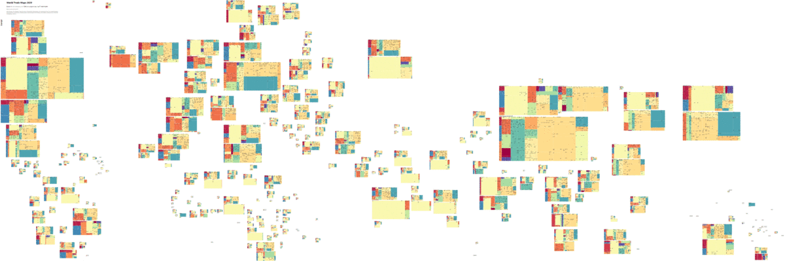

# World Trade Map 

Area-preserving pseudo projected cartogram treemaps of world countries annual net import/export in US$ by HS4/HS6 categories. [1995](https://xdqc.github.io/world-trade-map/worldtrademap-1995.html) ~ [2020](https://xdqc.github.io/world-trade-map/worldtrademap-2020.html)

The maps present intuitive answers to questions such as:

- Who are the flag states?
- Where most trees are deforested to ship out?
- When the rhythm of gold reserve breathing in & out in London and Swiss?
- Which country exports most agri & food after the US?
- What natural resource in periodic table does Japan export?
- Why Norway is not joining EU?
- How Hong Kong being the infusion tube of Chinese economy?

and much more...

## FAQ

### Net vs Gross

Net import/export value is the value of deficit/surplus per category of trading goods, for instance, a country imports 400B and exports 50B crude oil, the net value only counts importing 350B crude oil, but no crude oil exported. 

The overall net deficit/surplus per country is constant no matter how granular the classification of trading goods is calculated. 

### HS2 vs HS4 vs HS6

HS2 is 2 digits classification code of trading goods, showing as the color of each block. HS4 adds 2 more digits of details to HS2; HS6 adds 2 more digits of details to HS4.

The more detailed granularity of classification, the larger net import and net export values respectively. More details is not more useful: in case we classify trading goods per make, model, ISBN, EAN, the net value would be almost same as gross value, then calculating net value is meaningless. 

HS6 only adds little marginal accuracy than HS4 while extra verbosity for most goods (other than diesel/gas large/mid/small cars). 

For general public not customs officers, HS4 descriptions are succinct and more relevant to common sense than HS6, but there are exceptions, i.e., HS4 malt extract is majorly meaning infant milk formula.

### Inflation vs Actual trade growth

Cumulative inflation is adjusted based on https://www.usinflationcalculator.com/

### Group of contries

Trade maps of [Country groupings](https://en.wikipedia.org/wiki/List_of_country_groupings) can be generated with the script.

Also arbitrary groups like: 

- [Island-Landlocked-Coastal](https://xdqc.github.io/world-trade-map/Islands_Landlocked_Coastal.html)

- Former [Axis-Anglo-Commie-TheRest](https://xdqc.github.io/world-trade-map/Axis_Commie_Anglo_Rest.html)

### Data source

https://oec.world/

### Visualization tool

https://rawgraphs.io/

### Inspired by

https://www.reddit.com/r/MapPorn/comments/e3u0fj/2018_gdp_cartogram_ocsize_nominal_gdp_colors/

https://finviz.com/map.ashx?t=geo
