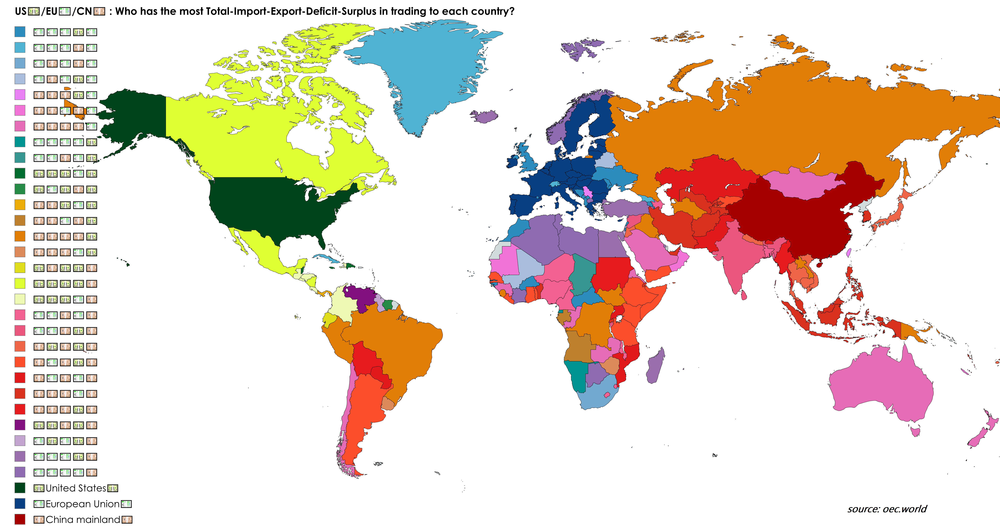

# The T.I.E.D.S. Problem: Counting Unique Trade Patterns

 

### Introduction

Consider a set of $n$ trade partners, each engaging in imports and exports with other countries. We are interested in labeling each partner according to five categories derived from their trade data:

1. **Total (T)** – the partner whose combined imports and exports is largest.
2. **Importer (I)** – the partner with the largest imports.
3. **Exporter (E)** – the partner with the largest exports.
4. **Deficit (D)** – the partner with the largest import minus export difference.
5. **Surplus (S)** – the partner with the largest export minus import difference.

A **pattern** is an ordered 5-tuple $(T,I,E,D,S)$ of partners realized by some assignment of import/export numbers with all argmaxes unique.

The **TIEDS problem** is: 

  > *How many distinct patterns are possible as a function of $n$?*

---

### [Calculation](./Calculation.md)